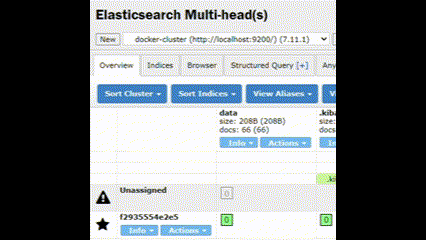

# WooriFISA 미니프로젝트 : 1분의 인기스타
#### 😃이름과 😍좋아요 더미데이터를 1초당 10개씩 데이터를 생성 하여 ELK 사용하여 시각화 및 crontab을 사용하여 1분마다 csv 파일 삭제

<br/>

<details>
  <summary>목차</summary>  
  
  - [수행 과제](#notebook-수행-과제)
  - [팀원](#raising_hand-팀원)
  - [실습환경](#실습환경)
  - [시각화](#bar_chart-시각화)
  - [트러블슈팅](#hammer-트러블슈팅)
  - [회고](#thought_balloon-회고)
      
</details>

## :notebook: 수행 과제
- Faker 라이브러리 데이터 자동 생성
- Crontab 자동삭제
- 사용자 데이터 분석 및 시각화

<br/>

## :raising_hand: 팀원

|  |  |  |  |
|:---:|:---:|:---:|:---:|
| [강유완](https://github.com/yuwankang) | [안재형](https://github.com/recoild) | [이정욱](https://github.com/jeonguk0201) | [조성현](https://github.com/cshharry) |

<br/>

## 데모
  

## 실습환경
:penguin: **Ubuntu server 22.04.4 LTS**
:book: **ELK Stack 7.11.1**

<br/>

## 가짜 데이터 생성


#### 실행 코드
```
python3 generate_fake_data_periodically.py
```
#### fake_data.csv 파일 생성


#### crontab을 사용하여 1분마다 csv 파일 삭제


### crontab 설정
#### 크론탭 열기
```
crontab -e
```
#### fake_data.csv 1분마다 삭제
```
* * * * * rm /home/username/fake_data.csv
```
### 💪Docker-Compose 사용


## :bar_chart: 시각화
<p align="center">
  
  

</p>

<br/>

## :hammer: 트러블슈팅

### filebeat.yml 권한 수정
```chmod go-w ./filebeat.yml```

---

### path 경로를 호스트 경로로 설정했더니 인식을 못해서
### 컨테이너 내부 경로로 설정해 해결


```
paths:
    - /usr/share/filebeat/data/fake_data.csv
```

<br/>

## :thought_balloon: 회고
### 강유완
> 
<br/>

### 안재형
> 
<br/>

### 이정욱
> 
<br/>

### 조성현
> 
<br/>
